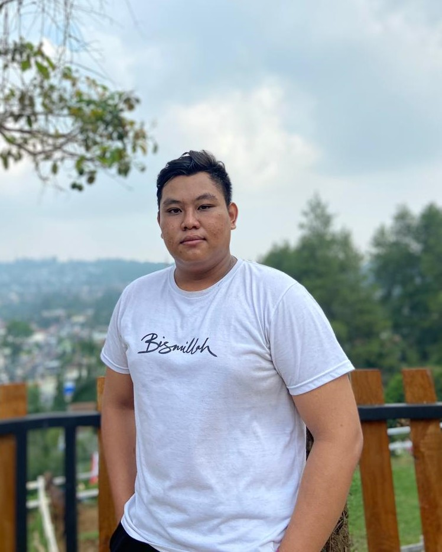
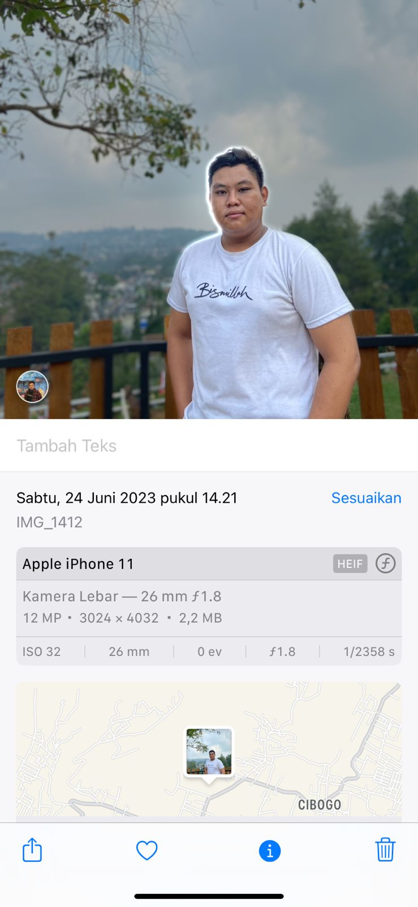
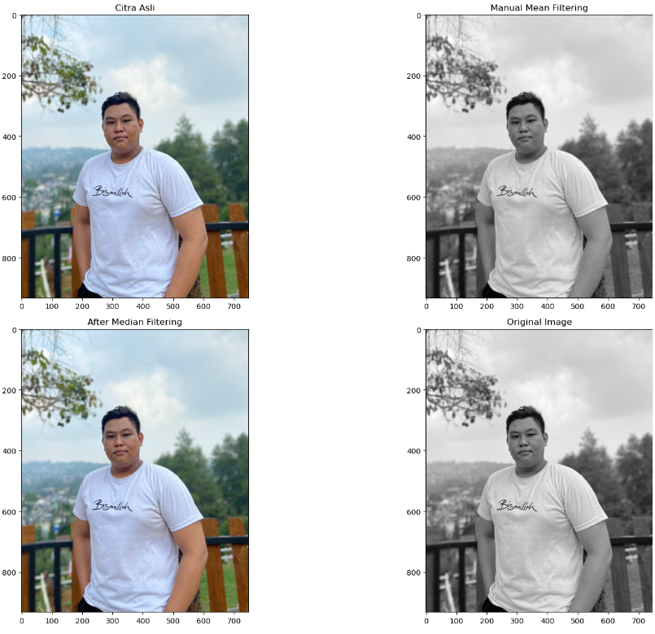

# UAS PRAKTIKUM PENGELOLAHAN CITRA DIGITAL

## Teori Filtering Citra
Filtering citra adalah proses memodifikasi piksel-piksel dalam suatu citra digital untuk mencapai tujuan tertentu, seperti meningkatkan kualitas citra, menghilangkan derau, atau mendeteksi fitur tertentu. Filtering citra dapat dilakukan dengan menggunakan berbagai teknik, seperti:

 - **Filtering spasial**: Teknik ini memodifikasi piksel-piksel berdasarkan nilai piksel di sekitarnya. Contoh teknik filtering spasial adalah filter rata-rata, filter median, dan filter Gaussian.
 - **Filtering frekuensi**: Teknik ini memodifikasi piksel-piksel berdasarkan frekuensi spasialnya. Contoh teknik filtering frekuensi adalah filter low-pass, filter high-pass, dan filter band-pass.
 - **Filtering morfologi**: Teknik ini memodifikasi piksel-piksel berdasarkan bentuk dan struktur geometrisnya. Contoh teknik filtering morfologi adalah dilasi, erosi, dan opening/closing.

Tujuan filtering citra dapat dikategorikan menjadi beberapa jenis, yaitu:
 - *Peningkatan kualitas citra*: Filtering citra dapat digunakan untuk meningkatkan kualitas citra dengan cara menghilangkan derau, meningkatkan ketajaman, atau memperbaiki kontras.
  - *Pengolahan citra*: Filtering citra dapat digunakan untuk mengolah citra digital untuk mencapai tujuan tertentu, seperti deteksi tepi, segmentasi objek, atau pengenalan pola.
  - *Analisis citra*: Filtering citra dapat digunakan untuk menganalisis citra digital untuk mendapatkan informasi yang berguna, seperti tekstur citra, bentuk objek, atau gerakan objek.

## Program Filtering Citra

```bash
    import cv2
    import numpy as np
    from matplotlib import pyplot as plt
```
Kode tersebut mengimpor perpustakaan OpenCV untuk pemrosesan gambar, NumPy untuk operasi numerik, dan Matplotlib untuk menampilkan hasilnya.

```bash
def manual_mean_filtering(image, kernel_size=3):
    h, w = image.shape[:2]
    filtered_image = np.zeros((h, w), np.uint8)
    k = kernel_size // 2
    
    for i in range(k, h - k):
        for j in range(k, w - k):
            region = image[i - k:i + k + 1, j - k:j + k + 1]
            mean_value = np.mean(region)
            filtered_image[i, j] = mean_value
    
    return filtered_image
```
Kode `manual_mean_filtering` menerapkan filter rata-rata pada gambar dengan menghitung rata-rata nilai piksel di sekitar setiap piksel menggunakan kernel berukuran tertentu, kemudian mengganti nilai piksel tersebut dengan nilai rata-rata yang telah dihitung untuk menghasilkan gambar yang lebih halus.

```bash
image_path = 'profil.jpg'
image = cv2.imread(image_path)
```
Kode tersebut mengimpor OpenCV dan membaca gambar dari file 'profil.jpg' untuk disimpan dalam variabel `image`.

```bash
if image is None:
    raise FileNotFoundError(f"Gambar tidak ditemukan di path: {image_path}")
```
Kode tersebut digunakan untuk memeriksa apakah variabel `image` memiliki nilai `None`. Jika ya, kode akan melempar exception `FileNotFoundError` dengan pesan yang menunjukkan bahwa file gambar tidak ditemukan di path yang ditentukan (`image_path`).

```bash
gray_image = cv2.cvtColor(image, cv2.COLOR_BGR2GRAY)
mean_filtered_image = manual_mean_filtering(gray_image, kernel_size=3)
median_filtered_image = cv2.medianBlur(image, 3)
```
Kode tersebut mengubah citra `image` ke citra skala abu-abu dan kemudian menerapkan filter rata-rata manual dengan ukuran kernel 3 serta filter median menggunakan OpenCV.

```bash
plt.figure(figsize=(18, 12))

plt.subplot(2, 2, 1)
plt.imshow(cv2.cvtColor(image, cv2.COLOR_BGR2RGB))
plt.title('Citra Asli')
plt.axis('on')

plt.subplot(2, 2, 2)
plt.imshow(mean_filtered_image, cmap='gray')
plt.title('Manual Mean Filtering')
plt.axis('on')

plt.subplot(2, 2, 3)
plt.imshow(cv2.cvtColor(median_filtered_image, cv2.COLOR_BGR2RGB))
plt.title('After Median Filtering')
plt.axis('on')

plt.subplot(2, 2, 4)
plt.imshow(gray_image, cmap='gray')
plt.title('Original Image')
plt.axis('on')

plt.tight_layout()
plt.show()
```
Kode ini menggunakan Matplotlib untuk membuat subplot dari empat gambar dalam satu figure, termasuk gambar asli, hasil filtering mean manual, hasil filtering median, dan versi grayscale dari gambar asli.

**Gambar Sebelum di Filtering**


**ScreenShot Gambar**


**HASIL OUTPUT**


**JURNAL TEORI**
- "APLIKASI FILTERING PADA DOMAIN SPASIAL UNTUK DETEKSI TEPI CITRA DIGITAL" oleh Teknomatika: Jurnal Informatika dan Komputer - E-Journal of Universitas Jenderal Achmad Yani Yogyakarta [ejournal.unjaya.ac.id]. Jurnal ini membahas tentang filtering domain spasial untuk deteksi tepi citra digital.
- "Peningkatan Kualitas Citra Dengan Gaussian Filter Terhadap Citra Hasil Deteksi Robert" oleh JIPI (Jurnal Ilmiah Penelitian dan Pembelajaran Informatika) Universitas Budi Darma [ejurnal.stmik-budidarma.ac.id]. Jurnal ini membahas tentang peningkatan kualitas citra dengan menggunakan filter Gaussian pada citra hasil deteksi Robert.
- "IMAGE SMOOTHING MENGGUNAKAN METODE MEAN FILTERING" oleh Ridwan - Jurnal UMK [jurnal.umk.ac.id]. Jurnal ini membahas tentang penggunaan filter rata-rata (mean filtering) untuk menghaluskan citra digital.
- "View of Teknik Filter Mean dan Median untuk Perbaikan Citra" oleh Jurnal Armada Informatika, STMIK Methodist Binjai [stmikmethodistbinjai.ac.id]. Jurnal ini membahas tentang perbandingan teknik filter rata-rata dan filter median untuk perbaikan citra digital.


